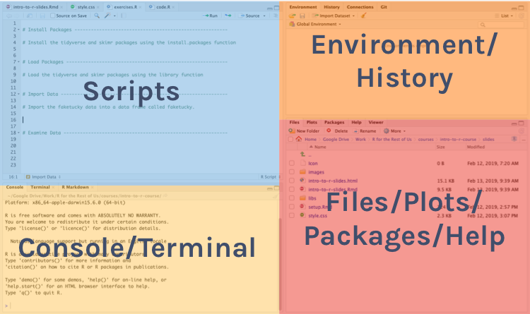

```{r setup, include=FALSE}
knitr::opts_chunk$set(eval = F, 
                      warning = F,
                      message = F)

library(xaringan)
```

class: center, middle, inverse, dk-section-title

**Slides adapted from David Keyes (@dgkeyes), inspired by Danielle Navarro (@djnavarro) and Paul Campbell (@paulcampbell91)**

---

class: center, middle, inverse, dk-section-title

# Welcome to our workshop!

---

class: center, middle, inverse, dk-section-title

# Agenda

--

- Intro to R & RStudio

--

- Intro to R Markdown

--

- Data Wrangling

--

- Data Visualization

---

## Stuck? Ask your partner


.center[
]

---

## Still stuck? Raise your hand


.center[
]


---

class: center, middle, inverse, dk-section-title

# Intro to R and Importing Datasets

---

### Download and Install R

•	Visit: http://www.Rproject.org/, choose the CRAN that is the closest with you physically. 

• Visit: https://www.rstudio.com/products/rstudio/download/

.pull-left[
]
.pull-right[
]

---

### Tour of RStudio

.center[

]

---

### Why do we recommend using RStudio


1) RStudio makes **script writing** easier.


---

### Why do we recommend using RStudio

2) RStudio makes it convenient to **view your environment** and interact with stored objects.


---

### Why do we recommend using RStudio

3) RStudio makes **graphics** accessible. 


---

## Two File Types in R

There are **two main file types** that you'll work with: 

.pull-left[
**R scripts (.R)**

Text is assumed to be executable R code unless you comment it (more on this soon)

```{r}

# This is a comment

data <- read_csv("data.csv")

```
]
--

.pull-right[
**RMarkdown files (.Rmd)**

Text is assumed to be text unless you put it in a code chunk (more on this soon)]

---

## R Scripts

Create new script file: File -> New File -> R Script


---


## R Start-up Kit: 4 Essential Skills ##

.pull-left[
* Case Sensitivity
* Run Codes
* Write Comments
* Handling packages
]

.pull-right[
]

---
## Skill 1 - Case Sensitivity

--

.pull-left[R is **case sensitive** so choose one of the following for all objects and **be consistent**.]

--
.pull-right[]

---

.pull-left[
**Options**

snake_case 

camelCase

periods.in.names
]

--

.pull-right[

**Examples**

student_data

studentData

student.data
]

---
Art by @allison_horst


---

## Skill 2 - How to Run Code

Run the code: 

--

.pull-left[
If you have Windows: control + enter 

]

--

.pull-right[

If you have IOS: command + enter 

]

---

## Skill 3 - Make Comments

Comments help others understand your codes & help yourself keep track of your coding.

```{r eval = F}
# Show the first 5 rows of my data
head(data, n = 5)
```


---

## Skill 4.1 - Install Packages

To install packages, use the "install.packages" command. See following syntax:

```{r eval=F}
install.packages("tidyverse")
install.packages("skimr")
```

The package name must be in quotation marks when you install them.

---

## Skill 4.2 - Load Packages

To load packages, use the "library" command. See following syntax:

```{r eval = T}
library(tidyverse)
library(skimr)
```

--

.dk-highlight-box[
Packages should be loaded **once per session**. 
]

--

.dk-highlight-box[
Packages should be installed **once per computer**.
]

---

## Import Datasets

### CSV

```{r eval = F}

chds6162_data <- read_csv(here("data", "chds6162_data.csv"))

chds6162_data <- read_csv("data/chds6162_data.csv")

```

---

### Excel

```{r eval = F}
library(readxl)

chds6162_data <- read_excel("data/chds6162_data.xls")

```

--

### SPSS

```{r = FALSE}
library(haven)
chds6162_data <- read_sav("data/chds6162_data.sav")
```

---

## Set Working Directories

If the data file is in the working directory, you only need to specify its name.

```{r}
chds6162_data <- read_csv("chds6162_data.csv")
```

--

If the data file is not in the working directory, you need to specify the full path name.

```{r echo=TRUE}
chds6162_data <- read_csv("data/chds6162_data.csv")
```

--

.dk-highlight-box[
*Using an RStudio project sets your working directory to the folder where your project lives so you only need to specify the location relative to that*
]

---

## Where Does Our Dataset Live?

Data we have imported is available in the environment/history pane.

.center[

]

---


### ?function

.pull-left[Use the ? to get help about anything you're confused about

```{r}

?read_csv

```
]

.pull-right[]

