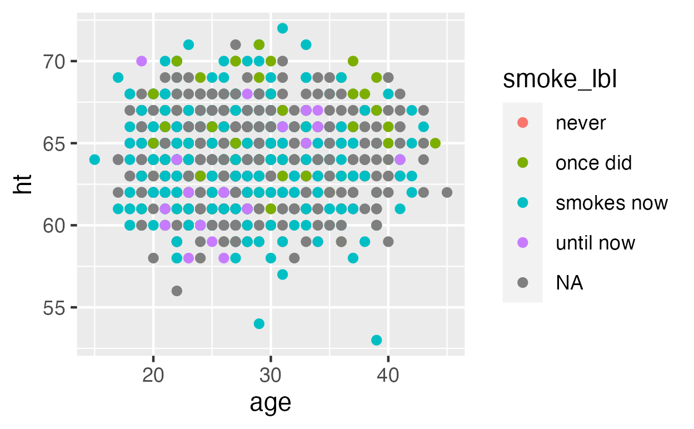

```{r include=FALSE}
knitr::opts_chunk$set(eval = F, 
                      warning = F,
                      message = F)
```

# ggplot


---

## ggplot structure
ggplots are built from:

+ a **data set**
+ a **coordinate system**
+ **aes** positions/maps the variables on the plot
+ a **geom** draws the graph (e.g, scatterplot, histogram, etc.)

---

# ggplot template

Think of your ggplot like a cake with layers

--

Each layer adds something to the graph

--

Layers:

--

`+ geom_histogram` (specifies that graph should be a histogram, etc.)

--

`+ ggtitle` (adds a title)
 
--

`+ theme` (adds a theme)
 
--

`+ facet_wrap(~var)` (split plots by specific variable)

---

## Some examples

--

### Basic Scatterplot

.pull-left[
**Markdown**

```{r eval=FALSE}

ggplot(data = data,
       mapping = aes(x = age,
                     y = ht)) +
  geom_point() #<<
```

]

--

.pull-right[
**Output**

]

---

### Basic Histogram

.pull-left[
**Markdown**

```{r eval=FALSE}
ggplot(data = data, 
       mapping = aes(x = age)) +
  geom_histogram() #<<

```
]

--

.pull-right[
**Output**


]

---

### Add some color with  `color = `

.pull-left[
**Markdown**

```{r eval=FALSE}
ggplot(data = data,
       mapping = aes(x = age,
                     y = ht,
                     color = smoke_lbl)) + #<<
  geom_point()

```

]

--

.pull-right[
**Output**


]

---

#### We can change which colors the data is mapped to by using a `scale_` function. 

.pull-left[
**Markdown**

```{r eval=FALSE}
ggplot(data = data,
       mapping = aes(x = age,
                     y = ht,
                     color = smoke_lbl)) + 
  geom_point() +
  scale_color_viridis_d(option = "plasma") #<<

```

]

--

.pull-right[
**Output**


]

---
### Plot titles and formatting
.pull-left[
**Markdown**

```{r eval=FALSE}
ggplot(data,mapping = 
aes(age,ht,color = smoke_lbl)) + 
  geom_point() + 
  scale_color_viridis_d(option = "plasma") + 
  labs(title = "My Title",  #<<
       subtitle = "My Subtitle", #<<
       x = "Age", #<<
       y = "Height (inches)", #<<
       color = "Smoking Habits") + #<< 
  theme_apa() 

```

]

--

.pull-right[
**Output**


]


---
#### `facet_wrap` creates separate plot for all of the labels in the "smoking" variable

.pull-left[
**Markdown**

```{r eval=FALSE}
ggplot(data,mapping = 
aes(age,
    ht,
    color = smoke_lbl)) + 
  geom_point() + 
  scale_color_viridis_d(option = "plasma") + 
  labs(title = "My Title", 
       subtitle = "My Subtitle", 
       x = "Age",
       y = "Height (inches)", 
       color = "Smoking habits") + 
  theme_apa() + 
  facet_wrap(~smoke_lbl) #<<

```

]

--

.pull-right[
**Output**


]

---
### Save your plots

- RMarkdown: just knit your file and your plots will show up as part of your HTML, Word, or PDF document.

--

- Use the `ggsave` function. 

--

- By default, `ggsave` will save the last plot you made. So you can add this line of code beneath each of the graphs you want to save:

--

```
ggsave("plots_folder/my_plot.png")
```

---

More Resources


---

More Resources: **Esquisse**

